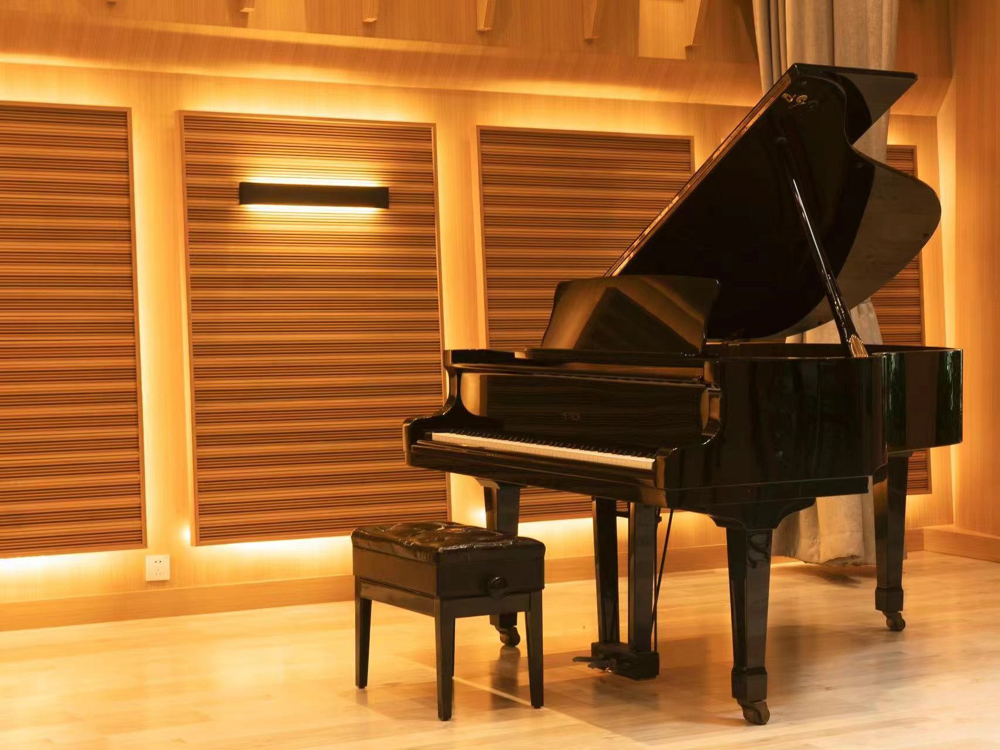
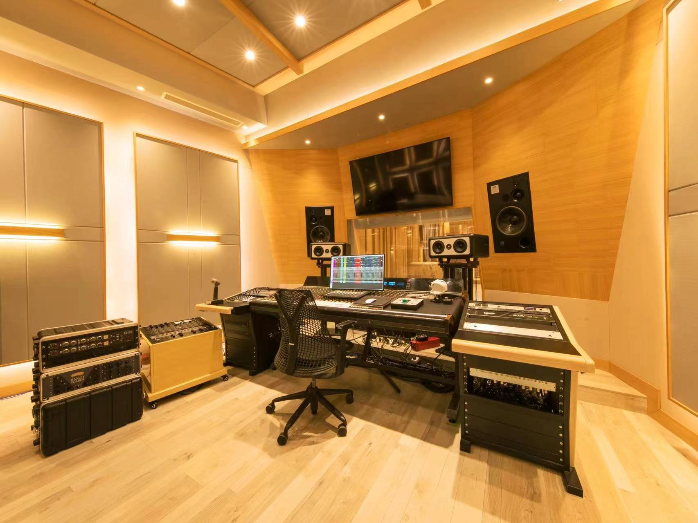
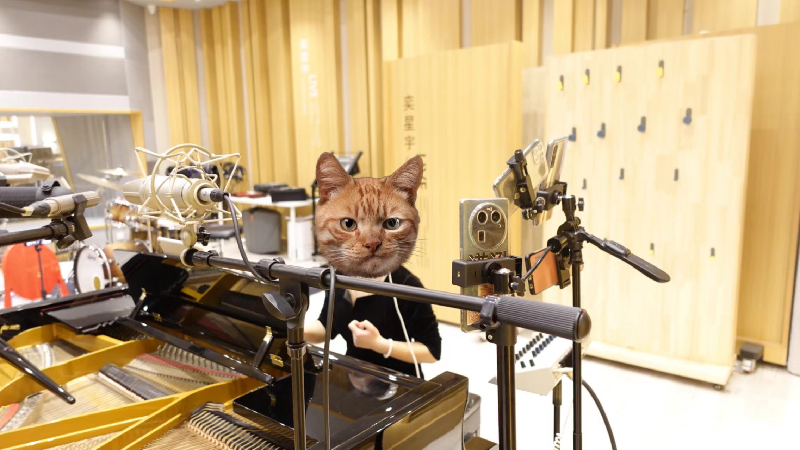

这是我的第一篇技术文档，我将尽可能完整地描述phone2pro数据集的背景，采集过程，细节和这个数据集能做什么。反正，完整性优先，行文结构慢慢迭代哈哈。

## 说在前面：音乐和AI

音乐领域的工作，目前比较好进展的工作都多多少少跟LLM（Large Language Model）的范式结合。例如说，利用SSL（Self Supervised Learning）的方式，去驱动海量的数据集。还有不少多模态方面的工作，例如，也就是文生音乐（google, facebook，openai的）。这种工作挺有趣的，无论是如何实现的，可以是输入音频，condition是文本；也可以是input是文本，condition是音频。类似的工作都要求文本和音频段的匹配。假如说48k的采样率的音频，几十秒的音频对应一个label。

这种工作当然也都是大力出奇迹的base，然后，我也很好奇有哪些trick可以让效果变好。但这类工作有个不能算是缺点的缺点，或者说这类工作的共性是什么呢？那就是无法对音频作出精细化的控制，或者他们也是输出一个decent的结果，听着像听着顺。这件事其实一开始的llm也是这样的，主要是看顺不顺，顺那就目标达成了。

但文本在此基础上能快速的迭代，不说具体的技术，光从人理解的角度来说，人能文本内容的生成质量做出很好的判断，生成的思路好坏，事实正确性，行文结构等等。但音乐太主观了。音乐评价虽然从作曲上有一套审美观，从演奏也有审美观，但相对来说还是太主观。

身为钢琴爱好者，个人感觉，针对音乐本身的工作真的太少了，精细化的控制就更不用说了。身为演奏者本身，我更希望能赋能演奏者。

## Phone2pro 的背景：问题

Phone2pro，字面意思，就是手机到专业，这里省略了“麦克风”。
众所周知，手机内置的麦克风和专业麦克风在硬件性能上有极大的差距。特别是当音源音量，频域的值域非常大且音频本身又内容丰富变化速度大的时候，这种硬件性能带来的音频录制的效果差距就更加明显。钢琴录音就和上述这种情况匹配。结合我自己录音的经历，我也可以很负责的说，这种差异非常显著。手机录音的效果会极大程度掩盖演奏者做出的努力。所以我希望在不硬件升级的同时，用软件就能达到这样的效果。用软件能达到这样效果的好处有两个
1. 就不需要花那么多钱在硬件上了； 
2. 录音的地点可以被解放，不需要去录音棚录，可以在任何地方在自己想要的设备上去录音

（补充具体硬件差异来源，以及性能指标，这里先mark一下，到时候单独出一篇报告进行比较）
## Phone2pro 的背景：Why Deep Learning

我们先从问题的本质和原理出发来探讨软件解决问题的可能性。有两点需要了解，第一点，那就是无损的琴声是怎么样的，第二点，手机录音的内部电路功能有哪些。
首先，钢琴的振动遵循物理学中的振动和波动理论，其中最基本的是简谐振动（harmonic motion）和泛音序列（overtone series）。简单来说，当你敲击钢琴键时，振动衰减的波形主要是指振动振幅随时间减小的过程，这在声学中通常被描述为指数衰减。振动的能量通过多种途径散失，包括通过空气的声学辐射、内部摩擦（材料的阻尼）以及与其他物体的相互作用（如琴弦与声板的耦合）。以下是描述振动衰减的一些基本声学方程和概念：
钢琴振动衰减的波形通常通过指数衰减来描述，这意味着振幅随时间以指数方式减小。振动能量的散失可以通过多种方式进行，包括空气的声学辐射、材料内部的摩擦（即阻尼）以及与其他物体（如琴弦与声板）的相互作用。以下是描述这种振动衰减的一些基础声学方程和概念：

1. 指数衰减模型
振幅随时间的衰减可以用下面的指数衰减模型来描述：
\[ A(t) = A_0 e^{-\alpha t} \]
其中：
- \(A(t)\) 表示在时间 \(t\) 的振幅。
- \(A_0\) 是初始振幅。
- \(\alpha\) 是衰减常数，代表振幅减少的速率。
- \(e\) 是自然对数的底数（约等于 2.71828）。

其次，我们需要了解手机录音的原理。由上文提到，手机由于硬件性能差距，无法无失真的处理很多极端情形。那么手机是如何处理这类信号的呢？模拟信号层面有调制器，限幅器等等。数字信号处理层面有回声消除，自动增益控制，噪声抑制，均衡器等等。

以自动增益控制为例，手机会实时的跟踪模型的短时能量，当检测到短时能量太大时，手机会调小自动增益控制，当然，反之则会调大增益。这会导致的结果，就是振动信号，不再满足指数衰减，而我们可能可以通过振动信号的前后帧关联推测此时的自动增益控制是否发生了变化。这种关联性，使得利用算法恢复演奏者的演奏处理变得可能。

具体怎么做呢？实际从钢琴发声到收音设备接收存储接收非常复杂，既然如此我们就用DL算法，让模型学习手机录制音频和专业麦克风录音的区别。给一段手机处理过的音频，还原出“原本”的样子（这里打引号是因为我们假设专业录音不会造成更多的失真）。

那训练数据集怎么获得呢？现在我们知道输入的是手机音频，输出的是专业音频。这个训练pair（x,y）怎么创造呢？有很多方案，这里就比较搞了。因为数据集的构建会直接影响到模型的选择，不同数据集方案也有不同成本。这里随便举几个例子。
1. 就是通过网络爬虫的方式，获得公开的数据集，搜集海量的专业专辑录音数据（音乐家的专辑），以及手机录音。这样可能能用一个模型学到手机录音的embedding，以及专业录音的embedding，使用一个GAN模型，学习一个生成器。但这里要担心的是，需要多大的数据才行，而这些数据使用是否合规。本身这里的数据工程也比较耗时。直接的成本比较低而已（爬虫不用钱毕竟，如果要当网络张三的话）。而且这里的数据，不是一一对应的，这是比较麻烦的一点。

2. 只搜集专业录音，并通过算法人为生成手机的录音，用算法实现前面说的所有电路操作。这个是非常电子信号类专业的套路了，没数据就自己创造。但这个也有上面的问题。

3. 自己采集数据，花点钱到录音棚自己录数据，最大优势就是可以做到帧对帧的音频对齐。这种方法缺点就是花钱！而且肯定数据量比较少。但从数据处理的角度来说，只需要后处理对齐就能快速使用了。专业录音数据集MAESTRO有将近178h的数据，其实也不大。所以这就是我们所使用的方案。
   
## Phone2pro 数据集

phone2pro是一个可以做到音乐音频逐帧对应的数据集。逐帧对应，就是同一段钢琴弹奏，有多支专业麦克风和手机同时的录音，这样能对比同一演奏瞬间不同设备的录音效果（先不说作用，但是我们能做到最细粒度的对比）。
我们在北京通州的一个录音棚进行了数据采集。录音棚里有个佩罗夫的三角钢琴，同时我们请了清华键盘队的同学进行演奏，演奏的曲目是肖邦的第一谐谑曲（这首曲子有快速音符跑动，大的音量变化范围，有丰富音乐元素）。我们使用了6支手机（涵盖不同品牌和型号），和6支专业麦克风进行同时录制。

<figure class="half">
	
	
	<figcaption>佩罗夫三角和录音棚</figcaption>
</figure>

我们做了四次录制，每次都是同一首曲子。四次实验专业麦克风的位置（由专业人士设置）都是固定的，而手机们被固定在同一个可移动支架上（这样就默认他们的位置一致），四次分别放置在了钢琴近左侧，近右侧，正后端（几米范围）以及远处（录音棚边缘，大概10几米），都是双声道。
<figure>
	
	<figcaption><a href="../assets/images/10411711456927_.pic.jpg" title="左边是搭好的专业麦克风，右边是临时组装好的一个夹多支手机的架子，把键盘队同学猫咪打码了">左边是搭好的专业麦克风，右边是临时组装好的一个夹多支手机的架子，把键盘队同学猫咪打码了</a>.</figcaption>
</figure>
总共录制了1.5个小时，不过有效录音时间在1个多小时。所以我们得到了11支 * 1 小时/支 的数据量，都是双声道，采样率为48khz。
录制结束后就需要对数据进行基本的后处理。专业录音麦克风都是连接到电脑上统一操作的，所以他们的时间戳自然就是对齐的，而手机需要进行人为对齐。我们使用logic pro，将音频加载，加载后进行剪辑对齐得到了我们的数据集phone2pro。但是由于这种对齐时人为对齐的，存在一定的误差。下面我们来听听吧，来自于手机和专业mic的音频效果（第一个是手机，第二个是专业mic）。
<audio controls>
  <source src="../../assets/videos/phone.wav" type="audio/wav">
  Your browser does not support the audio element.
</audio>
<audio controls>
  <source src="../../assets/videos/pro.wav" type="audio/wav">
  Your browser does not support the audio element.
</audio>

## 总结

Phone2pro数据集的诞生来源于对音频，对音乐内容细粒度掌控的需求，同时也是据我们所知，可以做到帧对帧label对应的数据集。如何使用他才能得到挖掘出其价值还是个难题。